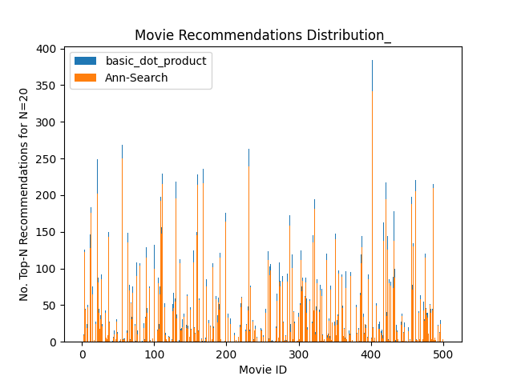

# Using Pinecone.io to scale SVD for a Movie Recommendation System

Singular Value Decomposition (SVD) is a popular technique used in recommendation systems. It was popularized during the Netflix challenge, where it proved highly effective for this use-case. SVD is a matrix factorization technique that is used to reduce the dimensionality of the user-item matrix. It is used to find the latent factors that can be used to predict the missing entries in the matrix. Vanilla SVD begins by filling missing values of the user-item matrix with a global average. It then decomposes the matrix into three matrices, U, S, and V. The U matrix represents the users, and has the dimension \$$users\$$ x \$$factors\$$. The S matrix represents the singular values, and it is a diagonal matrix of size \$$factors\$$. The V matrix represents the items, and has shape \$$items\$$ x \$$factors\$$. The diagonal elements of the S matrix are the singular values, which are used to represent the strength of the latent factors. Once this decomposition is created, a predicted rating for a given user-item pair can be computed by taking the dot-product between the corresponding rows in the U and V matrices.

### In this article, we will focus on the task of predicting each user-item rating at scale. Once we have the U and V matrices, how can we rank the top-n predicted movies for every single user? 

## The Brute-Force Approach

The [scikit-surprise library](https://surprise.readthedocs.io/en/stable/) is a popular python library for experimenting with recommendation systems. It provides a simple API for building and evaluating recommendation systems. In the API reference, it provides an [example](https://surprise.readthedocs.io/en/stable/FAQ.html#top-n-recommendations-py) of how one might retrieve the top-n predictions for each user in a dataset. This example uses the following steps:
```{verbatim}
for each user:
    for each item:
        if the user has not rated the item:
            predict the rating using the dot product of the corresponding rows in the U and V matrices
for each user:
    sort the predicted ratings and return the top-n items
```
This approach is not scalable. It has a time complexity of \$$O(users*items)\$$. In our toy-scenario for CMU's Machine Learning in Production class, we have a dataset of 1,000,000 users and 27,000 movies, which would require 27 billion iterations to compute the top-n predictions for each user. On the course VM with 2 CPUs and 12GM of RAM, this time complexity is far too large for regular model retraining. 

## The Alternative: Vector Databases
Vector databases are a modern solution to efficiently store and query high-dimensional vectors. They are designed to handle large-scale vector data, such as embeddings or feature vectors, and provide fast and accurate similarity search capabilities. Unlike traditional relational databases or key-value stores, vector databases are optimized for similarity-based operations, allowing users to find vectors that are most similar to a given query vector. These databases leverage advanced indexing techniques, such as approximate nearest neighbor (ANN) search algorithms, to achieve high-performance search operations. By utilizing vector databases, developers can easily build recommendation systems, content-based search engines, and other applications that rely on similarity matching.

## Pinecone.io
Pinecone is a commerically available vector database platfrom that supports serverless deployments- all you need to do to create a vector store is sign up and retrieve your API Key! Like many Vector databases, Pinecone uses approximate nearest neighbor search to efficiently retrieve the most similar vectors to a given query. How can this be used to collect the top-n recommendations for each user?

Pincone provides a python API that allows you to create a vector index, and insert vectors into it. When the index is created, you are required to specify a distance metric. This is because Pinecone uses an efficient approximation of kNN to retrieve our top-n recommendations. Once the index is created, you can query it with a given vector, and the query will return the top-n most similar vectors to the query vector.

Pinecone allows for the creation of an index with the `dotproduct` distance metric- which specifies that the more positive the dot product between two vectors, the more similar they are. This is exactly what we need to retrieve the top-n recommendations for each user.

Our new approach will look like this:

```{verbatim}
for each item:
    insert the item's embedding into the vector database
for each user:
    query the vector database with the user's embedding
    retrieve the top-n most similar items
```

This approach reduces our time complexity to \$$O(users * log(items))\$$. This is a significant improvement over the brute-force approach, and it allows us to scale our SVD model to large datasets. The bulk of the optimization comes from the creation of a tree-based index supporting log-n lookup times, and it is important to note that this index merely \$$approximates\$$ a kNN search. 

## How do the recommendations compare?
To examine the accuracy of the approximated-kNN search relative to our brute-force approach, we will generate a 10000-row data set of ratings, with 1000 users and 500 movies. We will train an SVD model on this data, and compare the top-n recommendations for each user using both the brute-force and Pinecone approaches. 

\

In above figure, we can see how many times each movie was placed in a user's top-20 recommended movies for both the brute-force and Pinecone approaches. We see that while the two approaches are not identical, they are very similar. The Pinecone approach is a good approximation of the brute-force approach, and it is a scalable solution for large datasets.

## Conclusion
In this article, we discussed how Pinecone's use of approximate kNN search can be used to efficiently retrieve the top-n recommendations for each user in a large-scale recommendation system. We compared the Pinecone approach to the brute-force approach, and found that the two approaches are very similar. It is important to note that another large part of the comercial appeal of Pinecone is its serverless deployment, which allows for easy scaling and deployment of the vector database. Users have no need to worry about the infratstructure required to store increasingly larger vectors. Pinecone uses cloud services to handle the scaling of the vector database, and the result is that each query incurs network latency. If you are confident that you can host your vector store locally and are not concerned with it scaling beyond your local capacity, then I would recommend searching for a vector database that can be hosted locally. Otherwise, Pinecone allows for the continuous updating and insertion to the created vector stores, and is an incredibly easy-to-use solution for large-scale recommendation systems.
